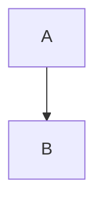

extract text later from first pdf writeup.

mermaid test:

html mermaid test:
<pre class="mermaid">
        graph TD
        A[Client] --> B[Load Balancer]
        B --> C[Server01]
        B --> D[Server02]
</pre>